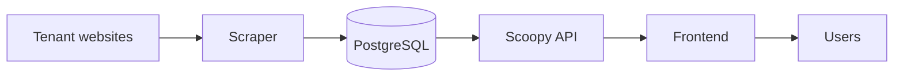

# Scoopy

<div align="center">


**Price tracking platform for product monitoring and history analysis**

Scoopy collects product prices from multiple tenants, stores the historical data in the database, and exposes it through an API that can be consumed by the frontend.

</div>

---

## Overview

Scoopy is split into three main parts:

- [Frontend](frontend/README.md) for the user interface and data visualization.
- [Scoopy API](scoopy-api/README.md) for the Rails backend that exposes product and price history data.
- [Scraper](scraper/README.md) for the Playwright-based automation that collects tenant prices and stores them in PostgreSQL.

Each part has its own README with the detailed setup, structure, and behavior of that subproject.

## What Scoopy Does

At a high level, Scoopy works like this:

1. The scraper reads product identifiers from the database and visits each tenant site.
2. The scraper extracts the current price and stores it in the historical price tables.
3. The API serves the stored products and price history to clients.
4. The frontend presents that information in a user-friendly interface.

The goal is to centralize price monitoring so the project can track changes over time and make the data easy to inspect.

## Project Structure

```text
Scoopy/
├── assets/
├── frontend/
├── scraper/
├── scoopy-api/
└── README.md
```

## Architecture



## Documentation

For the implementation details of each part, see:

- [Frontend README](frontend/README.md)
- [Scoopy API README](scoopy-api/README.md)
- [Scraper README](scraper/README.md)
