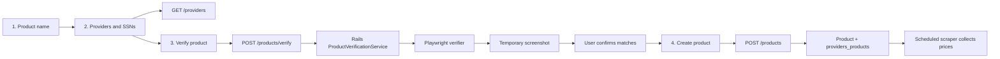

# Add Product Wizard

This document describes the product creation flow in Scoopy from the user interface to the scraper and the API. It is intended for users who need to add a product and for developers maintaining the feature.

## Overview

The wizard lets an authenticated user create one product and associate one SSN per provider. Before the product is persisted, each provider/SSN pair is verified in the provider storefront and a screenshot of the matched result is shown to the user.



## User Guide

The feature is available from the products page through **Add product**. The user must be authenticated and needs:

- A product name between 2 and 255 characters.
- At least one provider.
- The SSN or provider-specific product identifier for each selected provider.

### Step 1: Enter the product name

Enter the name that will be displayed in Scoopy. The wizard trims surrounding whitespace and validates the name before allowing the user to continue.

### Step 2: Add providers and SSNs

When this step opens, the frontend loads the available providers with `GET /providers`. Add a row for each storefront to monitor, select a provider, and enter its SSN. A provider cannot be selected twice in the same wizard. At least one complete row is required.

### Step 3: Validate screenshots

The wizard sends all provider/SSN pairs to `POST /products/verify`. The backend runs the provider-specific Playwright verifier for each pair and returns a temporary screenshot for every successful match.

Review each screenshot and select **Confirm match** for every successful item. Items with an error cannot be confirmed. The **Add product** action is enabled only when every returned item has been confirmed.

Possible results:

- A valid match displays the provider, SSN, and screenshot.
- A missing or invalid match displays a verification error and can be retried.
- A duplicate SSN displays the name of the product that already uses it. The same provider/SSN pair cannot be registered twice.
- If all items fail, the wizard shows a retry action and does not allow creation.

### Step 4: Confirm and create

After all screenshots are confirmed, the frontend calls `POST /products`. On success, the wizard shows the confirmation step and refreshes the products list. Closing the confirmation finishes the flow.

After creation, the product is available to the scheduled scraper. New price history appears when a scraping run successfully collects prices for its provider/SSN associations.

## Scraper Verification

The scraper entry point is `scraper/function/verifier.ts`:

```ts
verifyProductExist(provider_id: number, ssn: string): Promise<string>
```

For each item, it:

1. Rejects an empty SSN and unsupported provider id.
2. Resolves the provider verifier from the provider map.
3. Reads the provider URL from PostgreSQL.
4. Launches a Playwright Chromium context with the configured browser headers.
5. Runs the provider-specific search flow for the SSN.
6. Captures the matched product as a PNG buffer.
7. Writes the image to `scraper/tmp/screenshot/<uuid>.png` and returns the filename.
8. Closes the browser even when verification fails.

The supported provider ids are:

| Provider | `provider_id` |
| --- | ---: |
| Amazon | 1 |
| Carrefour | 2 |
| Primor | 3 |
| Druni | 4 |
| El Corte Ingles | 5 |

The provider-specific flows live in `scraper/verifier/`. Their selectors and search behavior are documented in the [verifier README](../scraper/verifier/README.md).

## Backend API

All product and provider routes require:

```http
Authorization: Bearer <jwt-token>
Content-Type: application/json
```

### `GET /providers`

Returns the providers available to the wizard:

```json
{
  "data": [
    { "id": 1, "name": "Amazon" },
    { "id": 2, "name": "Carrefour" }
  ]
}
```

### `POST /products/verify`

Receives an array of provider/SSN pairs. The batch must contain between 1 and 5 items, and provider ids must be unique.

Request:

```json
[
  { "provider_id": 1, "ssn": "B0DD7QY87R" },
  { "provider_id": 2, "ssn": "R-VC4AECOMM-718995" }
]
```

Successful response (`200 OK`):

```json
{
  "data": [
    {
      "provider_id": 1,
      "ssn": "B0DD7QY87R",
      "screenshot": "/screenshots/550e8400-e29b-41d4-a716-446655440000.png",
      "error": null
    }
  ],
  "meta": { "total": 1, "success": 1, "failed": 0, "all_failed": false }
}
```

Item-level failures use `error` values such as `duplicate_ssn` or `verification_failed`. A duplicate includes `product_name`. If every item fails, the endpoint returns `400 Bad Request` with the same `data`/`meta` structure and `meta.all_failed: true`. Invalid JSON, an empty batch, more than five items, or repeated provider ids also return `400`.

### `GET /screenshots/:filename`

Serves a generated PNG inline for the screenshot URL returned by verification. The filename must be a UUID ending in `.png`; invalid or expired files return `404`. This route is authenticated and reads only from the temporary screenshot directory.

There is no separate `POST /products/screenshots` route in the current implementation. Screenshot generation is part of `POST /products/verify`, while `GET /screenshots/:filename` serves the generated image.

### `POST /products`

Creates the product and its provider associations after the user confirms the verification screenshots. The frontend sends the following top-level payload:

```json
{
  "name": "Crema hidratante SPF 50",
  "provider_products": [
    { "provider_id": 1, "ssn": "B0DD7QY87R" },
    { "provider_id": 2, "ssn": "R-VC4AECOMM-718995" }
  ]
}
```

Successful response (`201 Created`) returns the product and its associations:

```json
{
  "id": "6557acf5-4087-4e67-afe5-6ec343ba4ad4",
  "name": "Crema hidratante SPF 50",
  "providers_products": [
    { "id": 10, "ssn": "B0DD7QY87R", "provider_id": 1, "provider_name": "Amazon" }
  ]
}
```

The backend validates the name, requires at least one association, validates every provider id and SSN, and creates the product plus all `providers_products` rows in one transaction. If any SSN already exists for that provider, the transaction is rolled back and the response is `400`:

```json
{
  "errors": [
    {
      "error": "duplicate_ssn",
      "provider_id": 1,
      "ssn": "B0DD7QY87R",
      "existing_product_id": "...",
      "product_name": "Existing product"
    }
  ]
}
```

Other validation errors return `400` or `422` depending on whether the request shape or persisted record is invalid. Unauthenticated requests return `401`. No rate limiting is implemented by these endpoints.

## Frontend Implementation

The feature lives under `frontend/src/features/products/`:

- `AddProductButton.tsx` opens the wizard from the products page.
- `AddProductWizardModal.tsx` coordinates the four steps, calls `POST /products`, handles cancellation, and refreshes the product list.
- `useAddProductWizard.ts` owns the current step, product name validation, navigation, and reset behavior.
- `useAddProductProvidersStep.ts` lazily loads providers, manages provider/SSN rows, prevents duplicate providers, and exposes validity state.
- `useProductScreenshotsStep.ts` calls verification when step 3 becomes active, normalizes results, handles retries and duplicate SSN messages, and tracks confirmations.
- `ProvidersStep.tsx` and `ScreenshotsStep.tsx` render the provider form and screenshot review UI.

The wizard keeps its state locally in React hooks. Moving back from the screenshot step preserves the provider form. Cancelling resets all state; removing the last screenshot asks for confirmation before returning to the provider step or exiting.

## Testing and Maintenance

Backend controller tests cover malformed verification payloads, the five-item limit, duplicate provider ids, all-failed verification, authentication, screenshot filename validation, and product creation. Future changes should add tests for the relevant controller, service, or hook behavior.

When changing a provider verifier, validate both the provider-specific scraper flow and the API path that invokes it. Keep temporary screenshot cleanup and the 30-second verifier process timeout in mind when diagnosing failures.

## Troubleshooting

| Symptom | Likely cause | Action |
| --- | --- | --- |
| Provider list does not load | API unavailable or expired token | Check API health and authentication, then retry. |
| Screenshot validation fails | SSN is invalid or provider selectors changed | Confirm the provider identifier and inspect verifier logs. |
| Duplicate SSN message | The provider/SSN pair belongs to another product | Use the existing product or choose another SSN. |
| All verifications fail | Browser, provider URL, database, or scraper error | Check PostgreSQL/Playwright configuration and scraper logs. |
| Product creation returns `422` | A model or database validation failed | Inspect the response `errors` details and backend logs. |
