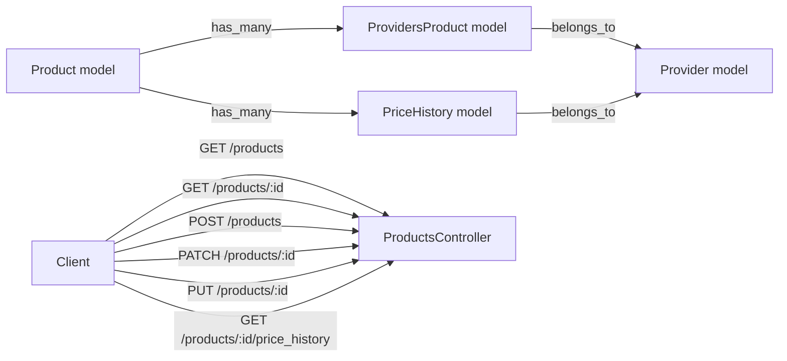

# Scoopy API

This document describes the `scoopy-api` Rails application, including folder structure, setup, routes, JSON input/output shape, and API behavior.

## Project structure

The `scoopy-api` folder contains the API backend built with Ruby on Rails.

- `app/controllers/` - API controllers. `ProductsController` handles product CRUD and price history endpoints.
- `app/models/` - Active Record models. Main models are `Product`, `ProvidersProduct`, `Provider`, and `PriceHistory`.
- `config/routes.rb` - REST routes for `products` and the custom `price_history` member action.
- `db/migrate/` - database migrations that create the tables and constraints.
- `db/schema.rb` - current schema snapshot.
- `Gemfile` - Ruby/Rails dependencies.
- `config/environments/` - environment-specific Rails configs.
- `config/initializers/` - Rails initialization code.

## Setup

### Requirements

- Ruby compatible with Rails `~> 8.1.3`
- PostgreSQL database
- Bundler
- `dotenv-rails` is configured if you use environment variables

### Install dependencies

```bash
cd scoopy-api
bundle install
```

### Database setup

```bash
bundle exec rails db:create db:migrate
```

If your database is already created, run:

```bash
bundle exec rails db:migrate
```

### Run the server

```bash
bundle exec rails server
```

By default the app runs on `http://localhost:3000`.

## API routes

The main API endpoints are defined in `config/routes.rb`:

```ruby
resources :products do
  member do
    get :price_history
  end
end
```

This creates:

- `GET /products`
- `GET /products/:id`
- `POST /products`
- `PATCH /products/:id`
- `PUT /products/:id`
- `DELETE /products/:id`
- `GET /products/:id/price_history`

## Data models and relationships

### Product

- has many `providers_products`
- has many `providers` through `providers_products`
- has many `price_histories`

### ProvidersProduct

- join model between `Product` and `Provider`
- stores `ssn` and `provider_id`
- is accepted as nested attributes from `Product`

### PriceHistory

- belongs to `Product`
- belongs to `Provider`

## How the API behaves

### GET /products

Returns a list of products with minimal fields.

Response sample:

```json
[
  {
    "id": "6557acf5-4087-4e67-afe5-6ec343ba4ad4",
    "name": "prueba1"
  }
]
```

### GET /products/:id

Returns a single product and its `providers_products` relations.

Response sample:

```json
{
  "id": "6557acf5-4087-4e67-afe5-6ec343ba4ad4",
  "name": "prueba1",
  "providers_products": [
    {
      "id": 1,
      "ssn": "ABC123",
      "provider_name": "Provider A"
    }
  ]
}
```

### POST /products

Creates a new `Product` and accepts nested `providers_products`.

Request sample:

```json
{
  "product": {
    "name": "prueba1",
    "providers_products_attributes": [
      {
        "ssn": "ABC123",
        "provider_id": 1
      }
    ]
  }
}
```

Response sample:

```json
{
  "id": "6557acf5-4087-4e67-afe5-6ec343ba4ad4",
  "name": "prueba1",
  "providers_products": [
    {
      "id": 1,
      "ssn": "ABC123",
      "provider_name": "Provider A"
    }
  ]
}
```

### PATCH /products/:id

Updates the product partially. If nested `providers_products_attributes` are provided, Rails will create new `ProvidersProduct` records unless an existing nested record is identified.

Request sample:

```json
{
  "product": {
    "name": "prueba1 updated",
    "providers_products_attributes": [
      {
        "ssn": "XYZ987",
        "provider_id": 2
      }
    ]
  }
}
```

Behavior:

- `PATCH` adds or updates without deleting existing `providers_products`.
- use nested `:_destroy` if you want to remove existing records and the child record is identified.

### PUT /products/:id

In this API, `PUT` is implemented as a full replacement for nested `providers_products`.

Behavior:

- `request.put?` clears existing `providers_products` before applying `update_product_params`
- the request body should include the full desired state for the product and its nested providers

Request sample:

```json
{
  "product": {
    "name": "prueba1 replaced",
    "providers_products_attributes": [
      {
        "ssn": "NEW333",
        "provider_id": 3
      }
    ]
  }
}
```

### DELETE /products/:id

Deletes the product and any associated `providers_products` and `price_histories` because of `dependent: :delete_all`.

### GET /products/:id/price_history

Returns the product data first and then its price history array.

Response sample:

```json
{
  "id": "6557acf5-4087-4e67-afe5-6ec343ba4ad4",
  "name": "prueba1",
  "price_history": [
    {
      "price": 9.92,
      "currency": "EUR",
      "created_at": "2026-07-05T14:05:30.310Z",
      "provider_name": "Provider A"
    }
  ]
}
```

## JSON request/response shape

### Create/Update `Product`

`POST /products` and `PATCH/PUT /products/:id` expect nested attributes under `providers_products_attributes`:

```json
{
  "product": {
    "name": "string",
    "providers_products_attributes": [
      {
        "ssn": "string",
        "provider_id": 1
      }
    ]
  }
}
```

### Product response

Product response includes a list of `providers_products` objects with `provider_name` method output.

```json
{
  "id": "uuid",
  "name": "string",
  "providers_products": [
    {
      "id": 1,
      "ssn": "string",
      "provider_name": "string"
    }
  ]
}
```

### Price history response

```json
{
  "id": "uuid",
  "name": "string",
  "price_history": [
    {
      "price": 0.0,
      "currency": "EUR",
      "created_at": "2026-07-05T14:05:30.310Z",
      "provider_name": "Provider A"
    }
  ]
}
```

## API flow diagram



## Notes

- `providers_products_attributes` is required for nested provider-product creation.
- `provider_id` must exist in the `providers` table, otherwise the database foreign key constraint will fail.
- The application is designed as an API backend. If you want a full front-end, add a separate client that calls these JSON endpoints.
- `PUT` is used here as a replace operation for nested children, while `PATCH` is used for partial updates.
