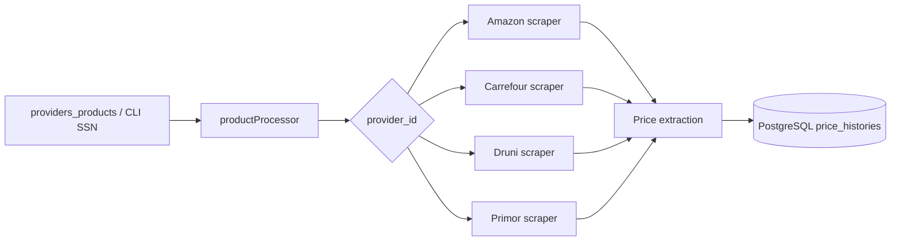

# Scraper

This package contains the browser automation layer used by Scoopy to collect product prices from different tenants and persist them in PostgreSQL.

The scraper is written in TypeScript and uses Playwright to drive real browser sessions. Each tenant has its own scraping flow because the search inputs, cookie dialogs, result selectors, and price widgets are different.

## What This Scraper Does

At a high level, the scraper:

1. Reads a product identifier from the database or from the CLI.
2. Chooses the correct tenant-specific scraper based on `provider_id`.
3. Opens a Playwright browser context with a realistic user agent and browser flags.
4. Navigates to the tenant site, handles cookies or modals, searches the product, and extracts the current price.
5. Stores the resulting price in the `price_histories` table.

The batch processor can iterate through all products in `providers_products`, while the single-product processor can scrape one product by its SSN and provider mapping.

## Architecture



## Important Concepts

- `SSN`: the internal product key stored in `providers_products.ssn`. The CLI uses this value to resolve the target tenant and product record.
- `provider_id`: the numeric tenant identifier used to pick the correct scraper implementation.
- `product_id`: the UUID of the product record stored in the database.
- `PLAYWRIGHTHEADLESS`: when set to `True`, the browser runs in headless mode. The code checks for the exact string `True`.
- `SCRAPER_LOG_FILE`: optional file path for persistent logs. If configured, logs are written to that file in addition to the default output.

## Tenant Guides

Each tenant has its own detailed guide with the search flow, selectors, and the common ways to identify the product key used by the scraper.

- [Amazon tenant guide](docs/tenants/amazon.md)
- [Carrefour tenant guide](docs/tenants/carrefour.md)
- [Druni tenant guide](docs/tenants/druni.md)
- [Primor tenant guide](docs/tenants/primor.md)

## Setup

1. Install the package dependencies from this directory.
2. Copy `example.env` to your local environment file and populate the PostgreSQL values.
3. Make sure the database contains the `providers_products` records you want to scrape.

Required environment variables:

- `PGHOST`
- `PGPORT`
- `PGUSER`
- `PGPASSWORD`
- `PGDATABASE`

Optional environment variables:

- `PLAYWRIGHTHEADLESS`
- `SCRAPER_LOG_FILE`

## Manual Execution

Build the TypeScript sources first:

```bash
cd scraper
npm install
```

Run a single product scrape by SSN:
from scoopy folder

```bash
npx tsx scraper/function/productProcessor.ts <SSN>                                
```

Run the batch processor for all products in the database:
from scoopy folder
```bash
npx tsx scraper/function/productBatchProcessor.ts 
```

If you want browser windows visible while debugging, leave `PLAYWRIGHTHEADLESS` unset or set it to any value other than `True`.

## Automatic Execution

The recommended automation path is to compile the scraper and then schedule the batch processor.

Typical production flow:

1. Load the environment variables.
2. Do an `npm install`.
3. Run `npx tsx scraper/function/productBatchProcessor.ts ` on a schedule.

Example cron job:
Please have in mind that tenants may apply restrictions if too many request are run at the same time

```cron
0 * * * * cd /path/to/Scoopy  npx tsx scraper/function/productBatchProcessor.ts 
```

Use the scheduler that fits your deployment style best, such as `cron`, a systemd timer, a container job, or a platform scheduler. The important part is that the batch processor runs in an environment where the database credentials and Playwright runtime are available.

## Product Notes Template

Use this section to document product-specific behavior, edge cases, or search hints you discover later.

| Product | Tenant | Identifier used | Search notes | Special cases |
| --- | --- | --- | --- | --- |
| Add your product here | Add tenant | Add SSN / reference | Add how to find it | Add exceptions |

## Troubleshooting

- If the scraper says the ASIN or SSN is missing, confirm the identifier exists in `providers_products`.
- If the tenant site changes its HTML, the selectors in the corresponding tenant guide will need an update.
- If the browser cannot connect to PostgreSQL, verify the `PG*` environment variables and the database network access.
- If logs do not appear in a file, confirm `SCRAPER_LOG_FILE` points to a writable path.